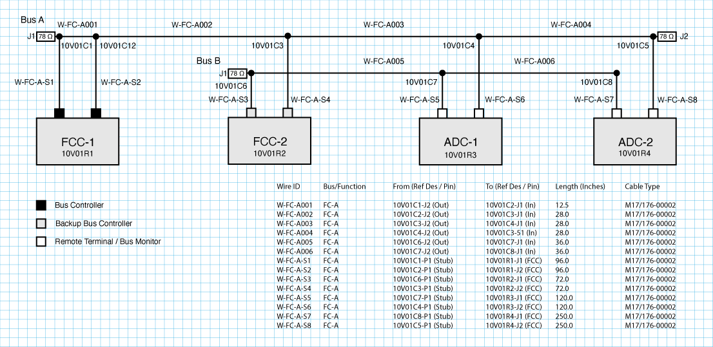
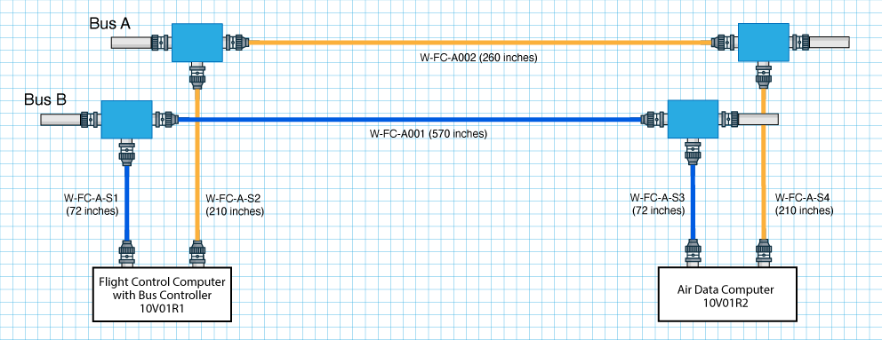
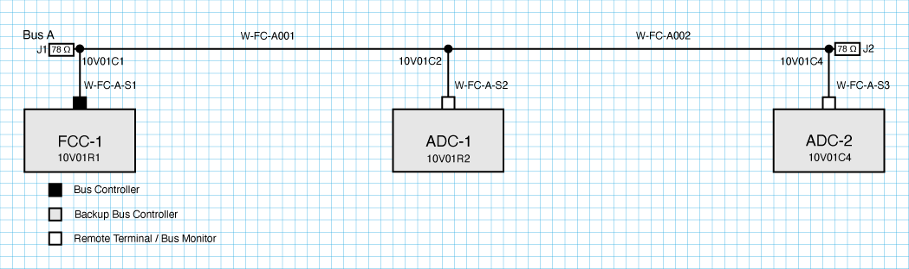
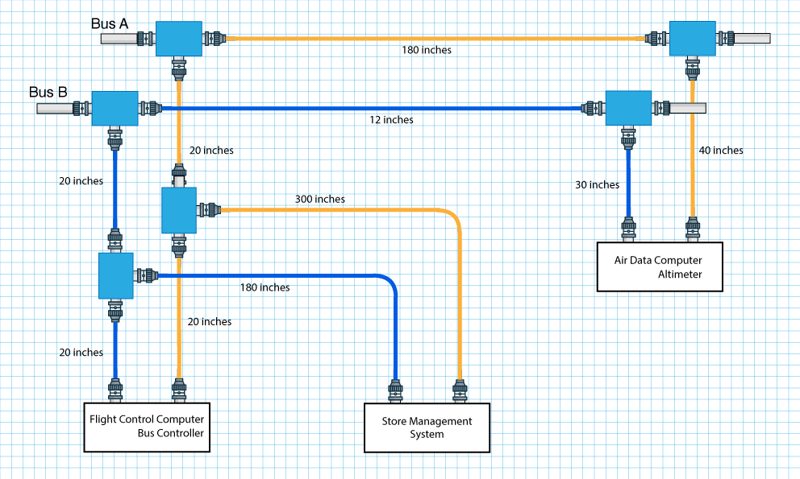
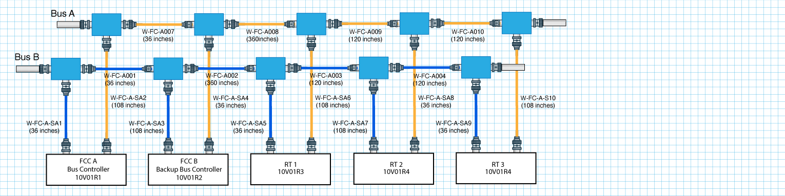
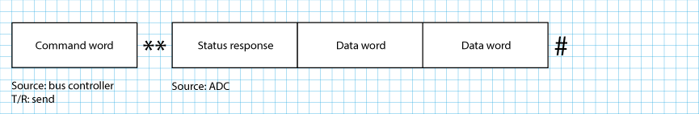
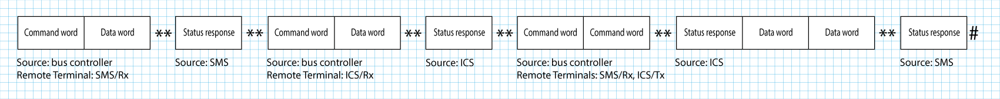

[//]: # (Lab_02.md)
[//]: # (Copyright © 2026 Joel A Mussman. All rights reserved.)
[//]: #

# Lab 2: Bus Architecture

\[ [Lab Table of Contents](./README.md#labs) \]

## Section A - Evaluate Architecture

### Lab Steps

Identify valid and invalid bus architectures and explain why:

1. Bus Architecture A
  `

1. Bus Architecture B
  `

1. Bus Architecture C
  `

1. Bus Architecture D
  `

## Section B - Build a bus

### Lab Steps

On paper design a robust topology for a medium-sized subsystem with three remote terminals and two flight control computers with
embedd bus controllers.
The bus is the foundation for flight control (FC):
1. Lay everything out as a physical interconnect diagram.

1. Bus A will run up one side of the airframe, Bus B on the other.
1. FCC A is three feet from Bus A, and nine feet from Bus B.
1. Device placement alternates on each side of the fuselage, so the FCC B is three feet from Bus B and nine feet from Bus A.
1. The couplers for the two FCCs are three feet apart on the bus.
1. The next bus segment is 30 feet away at the nose of the fuselage, and each following segment is another ten feet away.
1. The names of the bus segments and stubs are sequential. 
1. Ensure MIL-STD-1553 compliance.

## Section C - Map bus traffic

#### Part 1: Map the bus traffic for the altitude display process

The *Flight Computer* is often the bus controller and also responsible for the instrument display.
The *altimeter* is a sensor usually embedded in the Air Data Computer (ADC)
On paper map the traffic on the bus to initiate and complete an update of the altitude display.
This is not intended to be specific bit patterns or data sent on the bus, just a high-level view of who sends what and expects what information.

Show the blocks for the words that will appear on the bus in order, it is OK to separate responses for visibility.

#### Part 2: Map the bus traffic to arm and launch a Sidewinder missile

Weapons are under the control of the Store Management System (SMS).
The SMS itself is always on, but individual weapons must be powered up (armed) in order to launch.
The Sidewinder missile is a heat seeking missile.
When the pilot selects a target the radar (its own RT) must lock and follow the target as it moves in relationship to the attacking aircraft (this one).
When the pilot chooses to fire the missile the SMS needs to know where the target is in order to have the Sidewinder lock on to the heat signature of that particular
target, and then the weapon must be physically launched.
As in part 2, this is not intended to be specific bit patterns or data sent on the bus but just a high-level view of who sends what and expects what information.

  &nbsp; **Congratulations, you have completed this lab!**

  
# Answer Key

## Section A

1. Invalid: missing terminator at 10V01C8, both bus controller ports connected to Bus A, 
WA-FC-A001 is too short, both WA-FC-A-S7 and WA-FC-A-S8 are too long.
1. Valid.
1. Invalid: missing master wire list, wrong name on ADC-2 duplicates name of data bus coupler four, no redundant bus B.
1. Invalid: coupler chained from stub on another coupler, remote terminal on the bus side of a coupler, bus B segment too short
    stub segment too long, wire segments unlabeled, remote terminals unlabeled.

## Section B

## Section C

### Part 1

### Part 2

##
Copyright &copy; 2026. Licensed under the terms specified in the [LICENSE.md](./LICENSE.md) file at the root of this repository.