[//]: # (Lab_03.md)
[//]: # (Copyright © 2026 Joel A Mussman. All rights reserved.)
[//]: #

# Lab 3: Media Layer

## Simulate a physical bus network and check its characteristics

\[ [Lab Table of Contents](./README.md#labs) \]

### Result

The end product of this lab is a simulated MIL-STD-1553 bus:

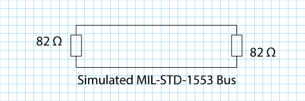

The 82 &Omega; resistors were chosen as a close match for the terminators used
in MIL-STD-1553 because 78 &Omega; resistors are used in specialized components (like the terminators) and
not available off-the-shelf.
The lab will check the resistance across the bus without the resistors,
with one resistor, with the two resistors, and with a wire shorting the two wires of the bus while the resistors
are in place.
Remember that the simulation uses 3.3 volts DC current while a real MIL-STD-1553 bus uses 18-20 volts AC current.

### Hardware Required

1. 6-inch breadboard (if the microcontroler is already mounted that is OK).
    *Do not touch this equipment without anti-static protection!*
1. Short-length breadboard jumper wires.
1. Two 82 &Omega; resistors (gray, red, black, gold, brown).
1. Multimeter and test leads (pin-tipped leads are preferred).

### Breadboard

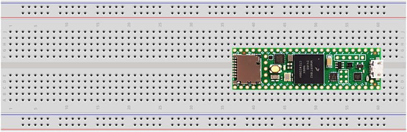

The breadboard is a device with sockets that integrated circuit boards and jumper wires may be plugged into.
It is organized by numbered horizontal rows and lettered vertical columns.
This breadboard has been rotated ninety degrees clockwise to make it easier to work with.

Each of the sockets in the + column are connected to each other.
The - column works the same way.
The two + columns on each side of the board are not connected together, and neither are the two - columns.
These columns are intended to be used for power to components on the board.

The sockets in the numbered rows are connected horizontally across each row, not vertically in the columns.
The *center isolation grove* in the middle breaks the horizontal connection into a left and right side.
The letters A-J are intended to be used to refer to a particular socket in a particular row (column first):
e.g. A10 or B10.

Jumper wires will be used to connect from one socket to another.
The jumper wires are 22 gauge wire and come in varying colors and lengths.

### Lab Steps

Note: in the classroom environment the breadboards are usually set up before class with the microcontrollers put in place
to avoid over-handling the component and breaking pins, etc.
When using non-classroom equipment (your own) you can place the microcontroller when you reach the corresponding lab.

1. Set up the anti-static mat and connect the ground cable to the same electrical ground as the power
    for the computer.
    It does not have to be the same power receptacle, just on the same electrical circuit.
    When outside of a classroom use a tester to see if the ground pin in the outlet is actually connected to ground; if it is not
    find another circuit for the computer and the anti-static mat.
    This is important, because the electronics will be grounded to the computer when the USB
    cables are plugged in, the mat needs to be grounded to the same circuit, and an ungrounded circuit
    wil...
1. Make sure to always wear the wrist-strap and have it connected to the anti-static mat when
    working with electronics.
    Failure to observe this will cause voltage to cross the sensitive electronics when it is
    picked up and handled, because the voltage always wants to stabilize.
    The voltage surge can burn out the electronics.
    When connected to the mat and touching objects on the mat, the voltage is already stabilized
    across everything.
1. Pick a short breadboard jumper wire.
    The color does not really matter, but we like blue because it is the center wire in a triaxial cable.
1. Put one end of the wire in E10 and other end in F10 to electrically connect the two halves of the row.
1. Pick another jumper wire (white is the other triaxial color, use gray or something light colored if you don't have white) and connect E9 and F9.
    Now row 11 is also connected all the way across.
      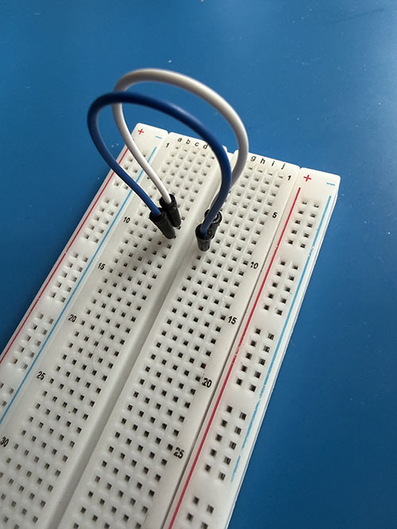
1. Plug the test leads into the multimeter.
    The positive lead (often red) will go in the socket marked for Ohms (&Omega;).
    The negative lead will go to the Common Ground.
1. If there are pin-tipped leads for the multimeter, connect the positive to H10 and the negative to H9.
    Otherwise, put jumper wires (any color, but we like red and black) into H10 and H9.
    If the leads have alligator-clips connect the positive to the jumper wire in H10, and the common (ground) to the wire in H9.
    If there are no alligator clips the meter leads will have to be touched to the wires manually to get a reading.
      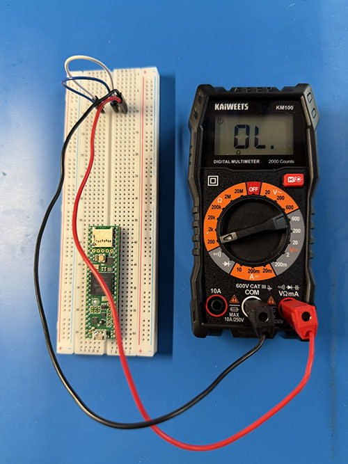
1. Turn the multimeter to the &Omega; (ohm meter) scale and select a low setting
    where values like 40 &Omega; and 80 &Omega; will be visible (on this meter the 200 &Omega; range works).
1. Take a reading.
    If the multimeter leads are not pin-tipped or alligator-clips manually touch the appropriate jumper wires: positive (&Omega;) to the wire in
    H10 and common (ground) to the wire in H9.
    What is the Ohm level on the multimeter?
1. The reading should be 0L: infinite resistance.
    This indicates the two rows are not connected.
    MIL-STD-1533 uses a bus with three wires: blue, white, and ground (the shield in the cable).
    This simulated bus was created using two wires, but
    the unconnected wires are not suitable for sending a signal on.
    While the resistance is infinite, any signal send on the wire will reflect
    at the unconnected end of the wire and the message will be garbled.
1. MIL-STD-1553 solves this problem with 78 &Omega; terminator resistors at each end of the bus.
    78 &Omega; resistors are specialized in components, so for this lab select two 82 &Omega; resistors (or 68 &Omega; in a pinch).
    Resistors are color coded, and
    82 &Omega; with four bands gray, red, black, and gold is a resister with 5% tolerance.
    Tolerance says the resistor will be close to 82 &Omega;. within 5% of that value.
    If there are five bands: gray, red, black, gold, and brown, then the resistor has 1% tolerance.
1. The leads on the resistors may need to be carefully bent down first if they have not been used before;
    grip the leads one at a time immediately next to the resistor with the pliers to support it, and bend the lead down with your fingers to make a 90-degree angle:
      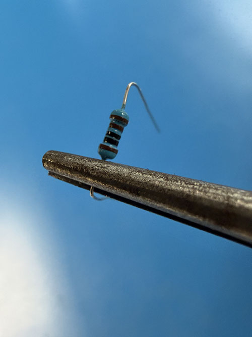
1. Using the needle-nose pliers to prevent breaking the leads off the resistor, place one 82 &Omega; resister at the left size of the bus across sockets A10 and A9.
1. Check the meter reading now, what is it?
    The bus wires are connected by the resistor, and the reading should be within 5% of its value.
    If you used a 68 &Omega; resistor expect the reading to be around 68.
      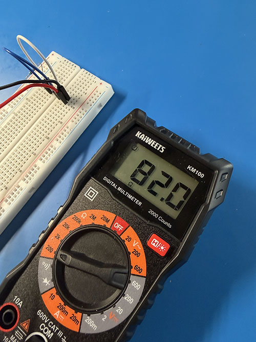
1. That only fixed half of the problem.
    The bus needs to be terminated at both ends.
    Add another 82 &Omega; (or 68 &Omega;) resistor to jump J10 to J9.
1. Take another reading, what do you get?
    The way electrical circuits work, the value should be cut in half: 41 &Omega; (or 34 &Omega; if you used a 68 &Omega; resistor):
      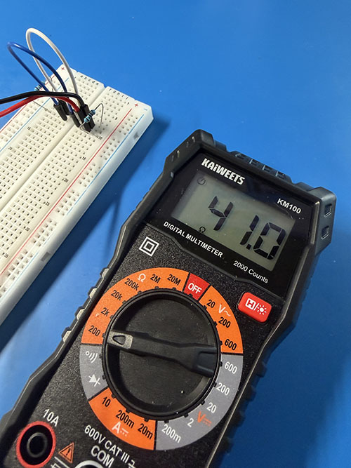

    A MIL-STD-1553 bus uses 78 &Omega; terminators (resistors);.
    The lab chose 82 &Omega; resistors simply because it is very difficult to find the 78 &Omega; resistors.
    82 is just a little higher than 78, but close enough for the simulation.
    From all of this it can be reasoned that on a real MIL-STD-1553 network a check of a cable and two terminators should read 39 &Omega;.
1. Add a short jumper wire (any color will do) across C10 and C11.
1. Take an &Omega; reading now, what do you get?
1. An &Omega; reading of zero or close to zero indicates a complete connection without any
    significant resistance on the wire.
    In other words, a short-circuit!
      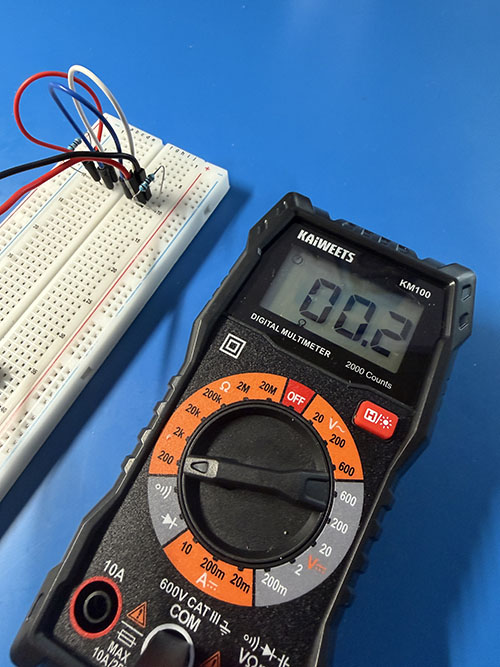
1. Remove the short-circuit in C10-C11.

### Conclusions

* When testing a cable all by itself, infinite resistance is a good thing: no short circuits!
* If the reading is close to 0 &Omega;, that means something is shorted out.
* If a connected bus is being tested, look for 1/2 the &Omega; value for the bus: 39 &Omega; on a real
    MIL-STD-1553 bus.
* If the reading with the terminators is wrong, something is causing it:
    * If the reading is twice what is expected, a terminator is missing.
    * If the reading is something else, maybe a terminator died.

  &nbsp; **Congratulations, you have completed this lab!**

  

## Instructor-led Classroom Experiment (Optional)

This optional section is designed for an instructor-led demo to the whole class group,
based on the following additional hardware.
This can be still explored individually, provided the MIL-STD-1553 network hardware is available,
and a Cable Fault Locator (TDR) is available for the second part.
Or, the results are in-line with the instructions!

### Hardware:

1. A multimeter with test leads
1. A BNC TDR cable fault locator
1. A Ponoma 5299 female TRD to male BNC adapter
1. Two 0.5-meter triaxial cables
1. One 3-meter triaxial cable
1. Two MIL-STD-1553 data couplers
1. One 78 &Omega; MIL-STD-1553 terminator
1. A female-female TRD (triaxial bayonet) adapter (to connect the terminator to a cable)
1. A female TRD jack, with three wires connected to center, ring, and ground
1. A 2mm DB female connector (like those in the female side of an old serial or RGB cable)

These are the components assembled (minus the female jack with the pigtail):

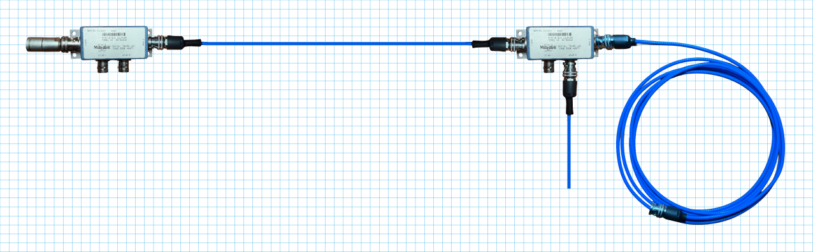

### Answer the following questions using the multimeter:

1. Connect the female jack and pigtail to just the 3-meter triaxial cable, use the alligator-clips to connect the blue and
    white wires to the multimeter, and check the ohm reading.
    What do you get?
    You should see 0L (infinite resistance) because the circuit is not complete.

1. At the other end of the cable insert a 2mm DB female connector to the side of the center pin (but on it) so that it touches
    the ring around the center and shorts the connector.
    It should just be snug enough to short out the blue and white wires (at the ring).
    Check the &Omega; reading, what is it now?
    0.0 - 0.2 &Omega;.
      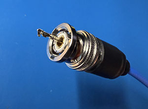
1. Remove the short and connect the female-female TRB adapter and the terminator to the cable.
    What is the ohm reading now?
    78-79 &Omega;.
1. Replace the terminator and adapter with one of the BIUs.
    Check the ohm reading, what is it now?
    60 &Omega;.
    On the primary side of the isolation transformer in the BIU there is a pair of isolation resistors
    at 0.75 x Zo where Zo is the characteristic impedance of the cable.
    For the 78 &Omega; bus this means each resistor is nominally at 56-59 &Omega; which explains the reading.
1. Add the terminator to the BIU and check the ohm reading.
    35 &Omega;.
    This is the math:
    <pre>
    1/Rtotal = 1/RBIU + 1/Rterm 
    1/RBIU = 1/60 ≈ 0.01666 S (Siemans)
    1/Rterm = 1/78 ≈ 0.01282 S
    1/Rtotal = 1/(0.01666 + 0.01282) ≈ 33.92 &Omega;</pre>
1. Replace the terminator with a 0.5-meter cable and the other BIU.
    What is the ohm reading now?
    30 &Omega;, the resistance was halved by the second BIU also coming on at 60 &Omega;.
    If BIUs continue to be added, the next one will drop the reading to 20 &Omega;, then 15 &Omega, etc.
    It is the same formula:
    <pre>
    1/Rtotal = 1/RBIU + 1/RBIU</pre>
1. Add the terminator to the second BIU and check the ohm reading.
    22 &Omega;.
    <pre>
    1/Rtotal = 1/RBIU + 1/RBIU + 1/Rterm</pre>
1. Add the other 0.5-meter cable to a stub on the first BIU.
    What happens for the &Omega; reading now?
    Nothing!
    The stub is isolated by the transformer.
1. Remove the second 0.5-meter cable from the stub on the first transformer,
    and replace the terminator on the second BIU with it.
1. Use the 2mm DB female connector to short the other end of the cable.
1. Check the ohm reading on the 3-meter wire.
    What happened there?
    It should have dropped way down showing the short circuit, possibly 0.5-1.0 &Omega;?
    This shows we can see the short circuit, but beware the maximum number of BIUs!
    Using the formula above thirty-two BIUs will come in at about 1.875 &Omega;, and with a terminator about 1.83 &Omega;.
    That is awfully close to mimicking a short circuit.

#### Conclusions

* The ohm meter can detect a short beyond multiple BIUs, although maximizing the number of BIUs brings the ohm reading
dangerously close to looking like a short circuit.
* The ohm meter can detect an open circuit on a single wire when infinite resistance is detected.
* Introducing one or more BIUs will provide resistance along the length of the bus, so infinite resistance is not
a possibility if the break occurs after the first BIU.
However, by identifying that the ohm reading is not a low as it should be for the number of BIUs on the bus,
the ohm reading shows how many BIUs are seen and the break has to be after the last one.

### Answer the following questions using the Cable Fault Locator

While an ohm meter can be used to see a break or a short circuit is present,
the goal of a TDR is to identify the location of the fault on the wire.
The TDR works by sending a signal on the bus and looking for a reflection, and calculating the distance
by calculating the time between sending the signal and detecting the reflection.
An open cable is a positive reflection which shows as a spike on the screen,
a short circuit is a negative reflection which shows as a dip.

The locator bundled for the class is a no-name generic time domain reflectometer (TDR) specifically designed for 1km telecommunications
and network cables, not for aerospace avionics.
The principle is the same, so even with the length difference this device provides a reasonable platform to explore with.
The TDR (if still available) was obtained from Amazon here: https://www.amazon.com/dp/B0BNN92FRZ.

1. Place the female TRB to male BNC adapter on the cable fault locator (TDR).
    This connects the blue and white lines from the triaxial cable to the center and shield
    connector of the BNC.

1. Connect the 3-meter cable to the TDR.
1. Use the *Auto* (F4) button to look at the cable.
    The pulse represents the open cable.
    The red *cursor* is positioned at the start of the pulse,
    and the display shows the meter has detected a *break* at about 2.5 meters.
      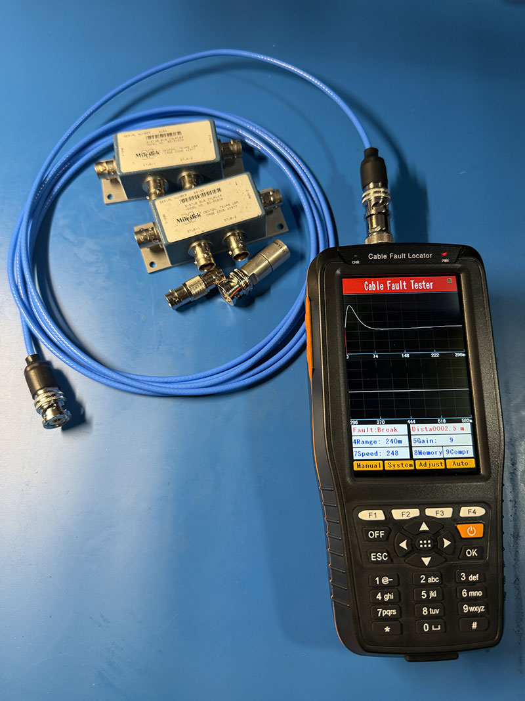
1. Use the 2mm DB female connector to short circuit the end of the cable and
    check the cable again with the *Auto* button.
    The tester sees the short circuit as a negative reflection, a dip on the display.
    The distance is not accurate though.
      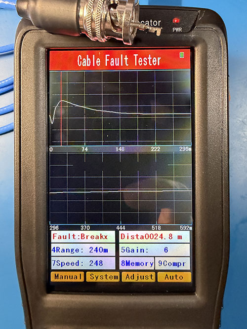
1. Connect the cable to a BIU, and check the cable again with the *Auto* button.
    The high pulse says tester sees the open line through the BIU as a fault, but the distance is about twice where it should be.
    This may happen because of the way the signal is reflected by the transformer in the BIU.
      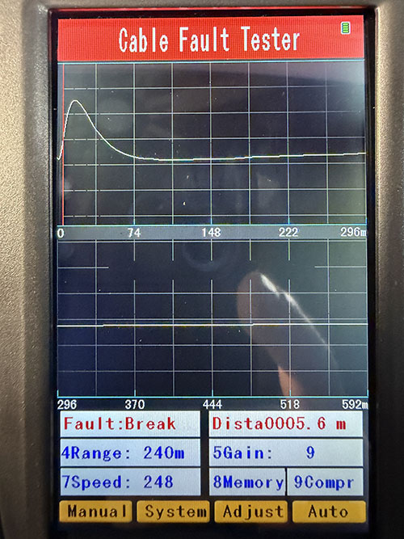
1. Put the terminator on the BIU and check the results.
    The pulse is lower, which indicates the line really isn't open, even though the tester says so.
      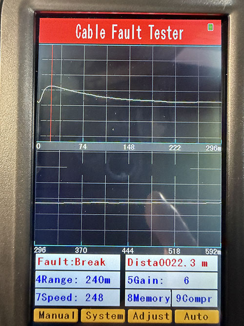
1. Remove the terminator, and add a 0.5-meter cable and the second BIU.
    The high pulse indicates the tester sees the open circuit.
      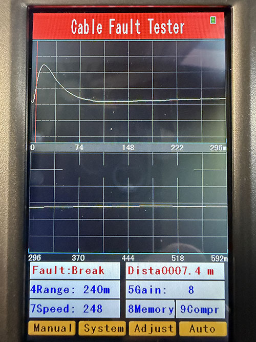
1. Add the terminator to the second BIU and check.
    The low pulse indicates the bump is simply a BIU, but the cursor at the leading edge says
    it is the first BIU.
      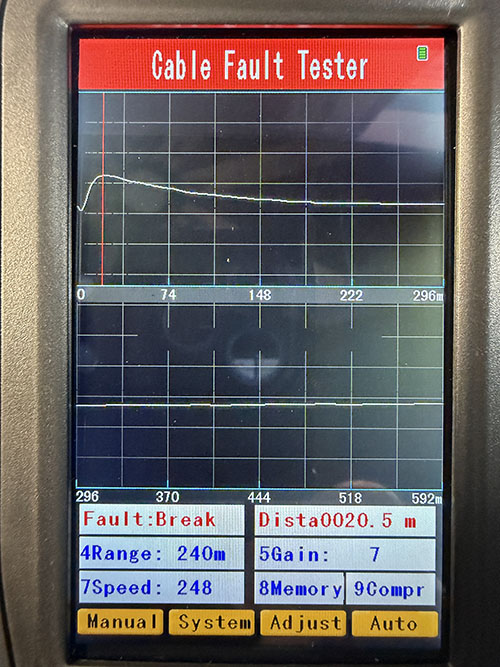
1. Add the second 0.5-meter cable to a stup on the first BIU.
    Interesting!
    The pulse is huge, and a large dip comes after the pulse and climbs back up over the second BIU.
      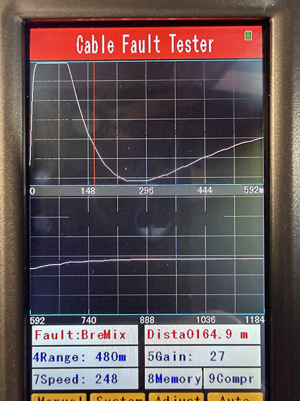
1. Remove the terminator.
1. Move the stub cable to second BIU where the terminator was.
1. Use the 2mm DB female connector to short circuit the cable, and run the check.
    The short passes all the way back as a negative reflection, with bumps for the BIUs on the bus.
      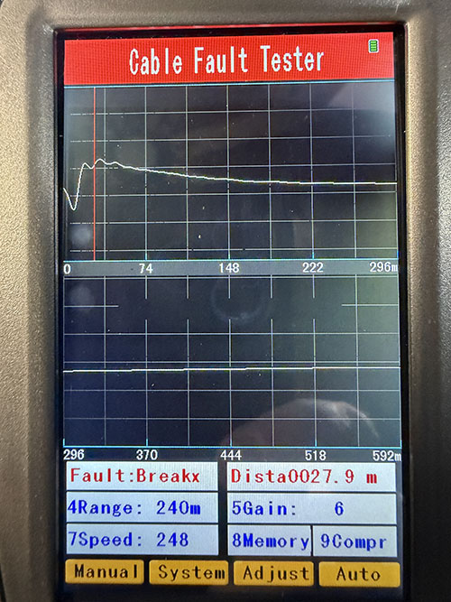

#### Conclusions

* The distance is thrown off by the meters.
    There must be a formula for how the BIUs and terminators are affecting this, so it may still
    be possible to calculate the true distance from the data shown.
    Otherwise, the ohm meter is the more effective way to go.
* The short circuit testing is no better than with a meter.
* The TDR advantage: if individual cables are tested while disconnected there is a good chance to find
    a break or short near the distance displayed on the tester.

##
Copyright &copy; 2026. Licensed under the terms specified in the [LICENSE.md](./LICENSE.md) file at the root of this repository.