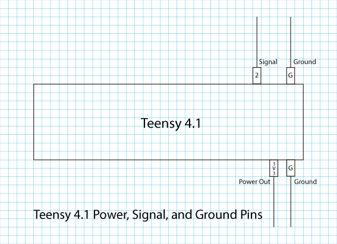
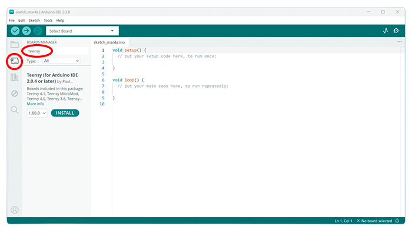
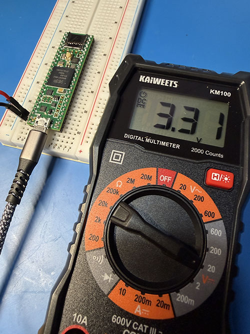
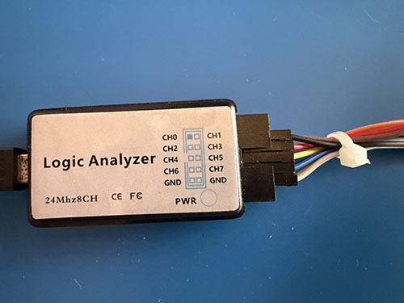
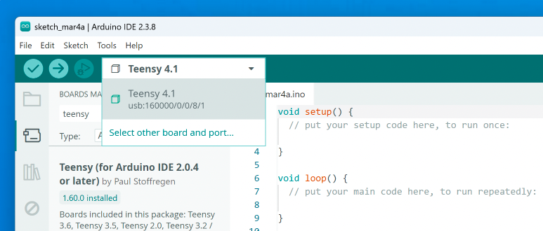
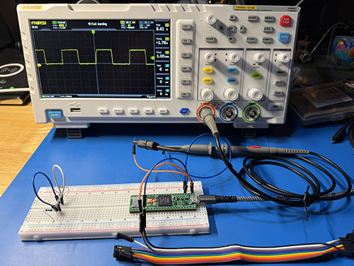
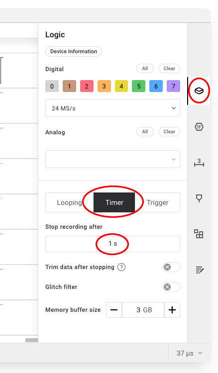
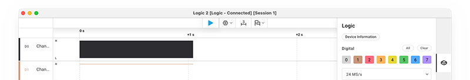
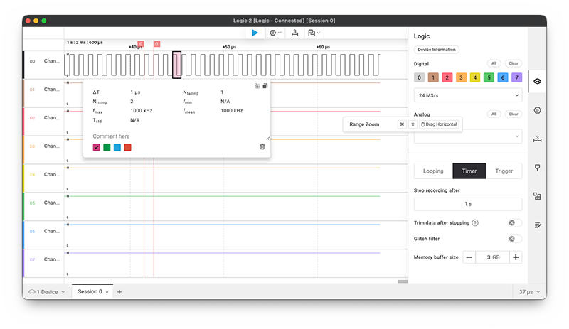

[//]: # (Lab_04.md)
[//]: # (Copyright © 2026 Joel A Mussman. All rights reserved.)
[//]: #


# Lab 4: Physical (Signaling) Layer

## Section A: Explore conversions to/from decimal hexadecimal and parity

\[ [Lab Table of Contents](./README.md#labs) \]

### Part 1: The BC needs to send a Command Word to the Flight Computer

The structure of a Command Word is not important right now, just the numbers:

* The Flight computer is at address 21
* The subaddress for the command is 02
* What are the hex values for 21 and 2?
* Compare your answer with your lab partner's

### Part 2: We captured a command on the wire

* The address was 11011
* The subaddress was 00110
* What are these values in decimal?
* Compare this answer to your partner's

## Section B: Set up and test the microcontroller

### Result

The goal of this lab is to hook up the ground (ground pin) and signal pin (pin 2) on the Teensy 4.1
to the logic analyzer and capture the signal.




### Hardware Required

1. 6-inch breadboard (if the microcontroller is already mounted that is OK)
    *Do not touch this without anti-static protection!*
1. Saleae-type Logic Analyzer
1. If you are working by yourself a small zip-tie (to set up the logic analyzer)
1. Medium-length breadboard jumper wires

### Lab Steps

#### Part 1: Software Setup

1. Open the Logic 2 analyzer program on the computer.
    * If necessary install the Saleae Logic 2 analyzer software, download it from [Saleae](https://www.saleae.com/downloads).
1. Open the Arduino IDE program on the computer.
    * If necessary install the Arduino IDE, download it from [Arduino Software](https://www.arduino.cc/en/software/).
    * The Arduino IDE runs through an installation the first time it is launched; several components require administrative access
    but the IDE will function without these components if that cannot be provided.
1. In the Arduino IDE navigate to the menu **File > Preferences** (Windows/Linux) or **Arduino IDE > Settings** (macOS).
1. In the **Additional boards manager URLs field**, paste this link:
https://www.pjrc.com/teensy/package_teensy_index.json.
    This will send Ardunio IDE to Paul Stoffregen's package supporting the Teensy development board located at [PJRC](https://www.pjrc.com/)
    (He designed the board and the Arduino library for it).
1. Click OK.
1. Find the *Board Manager* icon in the *Activity Bar* on the left of the IDE window and click it.
<br>
1. Enter *Teensy* in the search bar.
1. Make sure to select the Teensy board package by Paul Strofrregen.
1. Click the INSTALL button.
1. Wait for the installation to finish and the button name to change to *REMOVE*.
1. Click the *Board Manager* icon again in the *Activity Bar* to close the board manager.
1. Leave the Arduino IDE running while proceeding to the next part.

#### Part 2: Set up the Microcontroller

Note: in the classroom environment the breadboards are usually set up before class with the Teensy 4.1 microcontrollers put in place.
This is simply to avoid over-handling the Teensy and breaking pins, circuit traces, etc.
When using non-classroom equipment (your own) put the Teensy in place in step 2.

1. Make sure that the anti-static mat is tied to the same ground as the computer and the wrist-strap is worn and tied to the mat.

1. If the Teensy microcontroller board is not on the breadboard:
    * Remove the microcontroller from the anti-static bag.
    * Orient the microcontroller so the USB port is facing the bottom of the breadboard
    * Line up the pins on the microcontroller so the ground pin at the right of the USB connector is
        at socket G60 and the left pin is at C60.
        The reason for this placement is to put the USB port close to the edge of the breadboard, yet far enough from
        the edge that a plastic "spudge" can be used to get underneath and remove it.
        Notice that the microcontroller bridges the valley so the rows for the pins on the left and
        right sides are not connected, and jumper wires can be used with the pins on each side.
    * Carefully insert the microcontroller into the board.
        It is impossible to place a board of this size straight down, you will have to slowly apply pressure
        across the board from one end to the other.
        Be careful not to bend the board.
        It will take a little pressure, but about halfway down the female sockets in the breadboard open and allow the pins to enter.
        The headers are the pins soldered into the board, and they have spacer blocks placed over them on the bottom side of the board.
        The board should be seated with the blocks over the headers flush to the breadboard.
1. To the left of the microcontroller connect the multimeter negative test lead to row 59.
    This is one of two ground pins on the microcontroller.
    If the test leads have pin-tips connect directly to the board.
    If they do not, plug a jumper wire into row 59 and connect the multimeter negative test lead
    to that wire.
    If there are no alligator-clips the jumper wire and test lead must be held together to get a reading three steps down in the instructions.
1. Connect the positive test lead to row 58.
    This the 3V3 pin on the microcontroller.
    Switch to DC volts on the multimeter with a range of double digits (single digits is too small).
1. Connect the microcontroller to the computer with the micro-USB cable and give it a moment to boot up.
1. What is the voltage on the 3V3 pin?
    If it is about 3.3 volts the microcontroller board has the right voltage on its power rail,
    proceed to the next step.
    <br><br>
1. Disconnect the multimeter, it is no longer required.
1. Connect a jumper wire to H60 for the microcontroller ground.
1. Connect a jumper wire to H57 for the output signal (microcontroller pin 2).

#### Part 3: Set up the Logic Analyzer

1. Saleae-type USB Logic Analyzer: if the logic analyzer does not have the cable pigtail attached, connect the rainbow cable as:
    * black: channel 1
    * brown: channel 2
    * red: channel 3
    * orange: channel 4
    * yellow: channel 5
    * green: channel 6
    * blue: channel 7
    * purple: channel 8
    * gray: clock
    * white: ground.

1. If the rainbow cable was just set up, most of the ribbon cables provided with the Saleae-style Logic Analyzer have the black wire on the wrong side.
    Crossing it over to channel 1 puts strain on it.
    "Roll" the cable and use the zip about 0.5 inches (1.25cm) back to relieve that strain:
    <br><br>
1. Connect the ground wire from H60 to the white wire on the logic analyzer.
1. Connect the data wire from H57 to the black wire on the logic analyzer.
1. Connect the USB cable from the computer to the logic analyzer to power it on.
1. Launch the Saleae Logic 2 program on the computer and verify it connects to the logic analyzer.

#### Part 4: Program and Run the Microcontroller

The Ardunio IDE is used to compile C/C++ code using the Gnu C++ compiler, and upload it to the 

1. Connect the USB cable from the computer to the Teensy to power it on.
1. In the Arduino IDE pull down the board selection list and pick the Teensy.
    The port number should say "usb:<something>".
    Do not connect to the Teensy and pick another port, like a Bluetooth port if it is shown.
    <br><br>
1. Copy and paste the following program into the *sketch* file in the editor window,
    replacing the empty *setup* and *loop* functions:
    ```cpp
    #define OUTPUT_CHANNEL 2

    void setup() {
        pinMode(LED_BUILTIN, OUTPUT);
        pinMode(OUTPUT_CHANNEL, OUTPUT);
    }

    void loop() {
        digitalWrite(LED_BUILTIN, HIGH); 
        digitalWrite(OUTPUT_CHANNEL, HIGH);
        delayNanoseconds(375); 
        digitalWrite(LED_BUILTIN, LOW);
        digitalWrite(OUTPUT_CHANNEL, LOW);
        delayNanoseconds(375);
    }
    ```
1. Use **File > Save As** to save the program you just created.
    Name the file "Square_Wave_Test".
    The program will be saved in the **Documents/Arduino** folder by default.
1. Teensy will close and reopen the window with the file as you saved it.
    Pull down the device list again and make sure the microcontroller is properly selected.
1. Click the *Load* button at the upper left to compile the program and load it up
    to the microcontroller.
    If there are any compilation errors fix them and repeat.
1. The program will cause the LED on the board to blink very, very fast, almost impossible to see.
    It is also generating a square wave on pin 2 with a frequency of 1µs.
    If you have a scope and it is connected to ground and pin two on the microcontroller you will see the square wave
    as in the picture below.
    The period of the wave is 1µs, 0.5µs at 1.5 volts and 0.5µu at 0 volts.
    If you do not have a scope, no worries.
    Capturing that wave with the logic analyzer is what comes next!
    <br><br>


#### Part 5: Capture the Output.

Logic 2 works a bit like an oscilloscope, it can capture up to five channels simultaneously.

1. The Logic 2 program was left open in Part 3.

1. On the *Side Panel* to the right of the window are the tool icons.
    Click the first icon, *Device Settings*.
    <br><br>
1. Select the *Timer* button in the middle of the settings,
    and set *Stop recording after* to 1 second.
1. Along the toolbar at the top, click the first icon, the blue arrow *Run* button.
1. You will probably see one second of capture looking like this, because the zoom is all the way out:
    <br>
1. Use the mouse wheel or the up-arrow key to zoom in on the captured data.
    Go deep until you can see the square wave, it only a frequency of only 1µs.
    <br>
1. Click on the tool button with a "3" over an "I-beam", this is the *Range* button.
1. Click at the beginning of a period where the voltage is at the top (3.3 volts),
    and then drag the mouse to the end where the voltage stops being low (0 volts).
    The shaded area represents a second of time, and the period of this wave should be shown as 1µs.

#### Part 6: Cleanup

1. Make sure the anti-static wrist-strap is used for grounding.
1. Unplug the USB cable from the Saleae logic analyzer to power it off.
1. Unplug the USB cable from the microcontroller to power it off.

<br><br>&nbsp; **Congratulations, you have completed this lab!**


##
Copyright &copy; 2026. Licensed under the terms specified in the [LICENSE.md](./LICENSE.md) file at the root of this repository.
