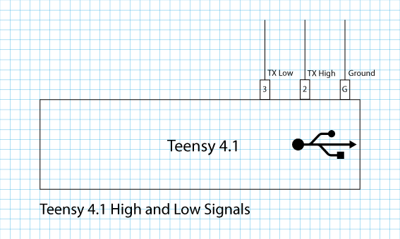
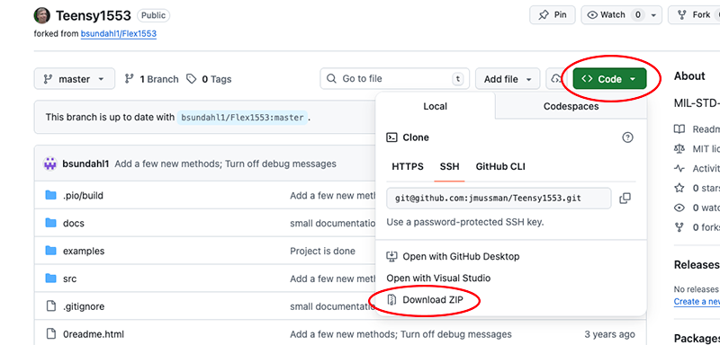
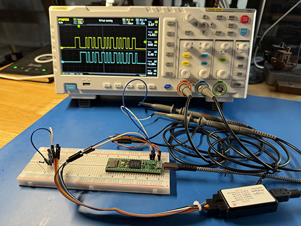
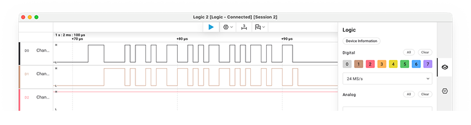

[//]: # (Lab_05.md)
[//]: # (Copyright © 2026 Joel A Mussman. All rights reserved.)
[//]: #


# Lab 5: Data Link Layer

\[ [Lab Table of Contents](./README.md#labs) \]

## Section A: Build and decipher words

1. Encode the following notations as binary and hexadecimal:
    1. RT8 R SA5 WC7
    1. RT2 T SA2 WC16
    1. RT5 T SA2 WC32
    1. RT3 R SA31 WC2
    1. RT7 R MC 02
    1. RT31 R SA31 MC17
    1. BCST MC17

1. What command was number 4? And #6?

1. Is remote terminal address 0 valid?

1. How many remote terminals can be on the bus?

1. How many devices can be on the bus?

1. Change the following values into command word notation, and 
    Build the binary command word including parity and the hexadecimal 16-bit command word.
    * RT address 03
    * Receive data
    * Subaddress: 04
    * Word count: 16

1. Change the following values into command word notation, and 
    Build the binary command word including parity and the hexadecimal 16-bit command word.
    * RT address 30
    * Transmit data
    * Subaddress: 01
    * Word count: 01

1. Build the binary and hex RT status word from the following values:
    * RT address: 07
    * Status: busy Flag Set

1. Decipher the following command words, and what type is each:
    * 0x3C64
    * 0xA2F0
    * 0xF845
    * 0x2BE2
    * 0xFBE1

1. Is it easier to decipher command words from hex or binary values? Why?

## Section B: Implement a BC in the microcontroller and send an RT to BC message

### Result

The goal of this lab is to generate command words with high and low sync from the microcontroller.
The low pin 3 is added to the high pin from the last lab:



### Hardware Required

1. The breadboard setup from the completion of Lab 4.
    *Do not touch this without anti-static protection!*

### Lab Steps

#### Part 1: Add the Explore1553 library to Arduino IDE

The Arduino IDE looks for folders under the *Documents/Arduino/libraries* and automatically loads them to support
the programs it is compiling (and loading).
This provides a scenario where libraries can be built, shared, and added to the IDE environment when they are required.

1. Find the green *Code* button at the top of this page,
    or visit [https://github.com/jmussman/Explore1553](https://github.com/jmussman/Explore1553) and
    find the button on that page.

1. Click the green button to expand the *Code dialog*.
1. Make sure the *Local* tab is selected and click on the *Download ZIP* option:
    <br><br>
1. Extract the zip file to your *Documents/Arduino/libraries* folder on the computer.
1. Rename the extracted folder from *Explore1553-main* to just *Explore1553*.
    The library for the lab is based on open source *Flex1553* package created by Bill Sundahl:
    [https://github.com/bsundahl1/Flex1553](https://github.com/bsundahl1/Flex1553).
1. Open the Visusal Studio Code application.
1. In VS Code, open the *Documents/Arduino/libraries/Explore1553* folder.
1. The repository is missing a properties file that Arduino looks for.
    Use the **File > New File...** menu option to open the wizard dialog to create a new file.
1. Select *Text File* as the type.
1. Copy and paste this text into the file:
    ```text
    name=Explore1553
    version=1.0.0
    author=jmussman
    maintainer=jmussman
    sentence=A modified version of the Flex1553 (https://github.com/bsundahl1/Flex1553) library supporting the Explore1553 sandbox.
    paragraph=The Arduino library enables high-speed 1553 protocol handling by leveraging the specialized FlexIO hardware on the IMXRT1060 processor.
    category=Communication
    url=https://github.com/jmussman/Explore1553
    architectures=teensy4
    includes=Flex1553.h
    ```
1. Navigate to and click *File > Save As...*
1. Name file *library.properties* (no other extension).
1. Save the file.

#### Part 2: Add a channel to the logic analyzer

1. Make sure the microcontroller and the logic analyzer are not powered.

1. Add another wire (white?) to H56 on the breadboard for the low signal at pin 3 on the microcontroller.
1. Connect this to the brown wire on the logic analyzer (channel 01).
1. Power on the microcontroller and the logic analyzer.

#### Part 3: Transmit an MIL-STD-1553 Command Word

1. In Arduino IDE navigate and click **File > New Sketch**.
    Programs are called "sketches" in Arduino.
    
1. New Sketch opens a new window, close the previous window.
1. Copy and paste this content into the new sketch file:
    ```cpp
    #include <Arduino.h>
    #include <Flex1553.h>
    #include <MIL1553.h>

    #define LEDPIN LED_BUILTIN
    #define RX1553PIN 6
    #define REMOTE_TERMINAL_ADDRESS 6   // Send to RT 6 subaddress 2 (no particular reason why these numbers)
    #define SUBADDRESS 2
    #define WORDCOUNT 5

    FlexIO_1553TX flex1553TX(FLEXIO1, FLEX1553_PINPAIR_3);
    FlexIO_1553RX flex1553RX(FLEXIO2, RX1553PIN);
    MIL_1553_BC  myBusController(&flex1553TX, &flex1553RX);
    MIL_1553_packet myPacket;

    void setup() {
        pinMode(LEDPIN, OUTPUT);
        myBusController.begin();

        myPacket.clear();
        myPacket.setRta(REMOTE_TERMINAL_ADDRESS);
        myPacket.setSubAddress(SUBADDRESS);
        myPacket.setWordCount(WORDCOUNT);
        myPacket.setTrDir((trDir_t)TRANSMIT);
    }

    void loop()
    {
        digitalWrite(LEDPIN, HIGH);
        myBusController.request(&myPacket, FLEX1553_BUS_A);
        digitalWrite(LEDPIN, LOW);
        delay(4);
    }
    ```
1. Use **File > Save As...** to save the new file as *RC_BC_Repeat_Command*.
1. When Arduino IDE reopens the window make sure that the correct microcontroller is selected.
1. Use the **Run** button to compile and load the program.
    This program will keep repeating the command word over and over again.
    <br><br>
1. In Logic 2 run a capture.
1. Zoom in to look at one signal group in the capture; remember the word keeps repeating.
    The FlexIO module is outputting the differential signal on pin 3, notice it is a mirror image of the
    channel 1 signal.
    The microcontroller cannot really handle that, so it is a positive signal when it should be negative,
    but that can be fixed (and the voltage bumped) in electronics around the microcontroller if it was interfacing to a real bus.
    <br><br>
1. Use the *Range Measurement* tool to check the length of the signal.
    What was found? Is that what was expected?

#### Part 4: Decode the Command Word

1. What kind of word does the Sync and word position indicate this is?

1. Turn the signal that you captured into a bit pattern.
1. Verify the checksum is correct, if it is not then the word is garbage.
1. Because this is a command or status word, figure out what the bits mean and put it in command word notation.
1. What is the RT address?
1. What is the T/R bit?
1. What is the subaddress?
1. How many data words are requested?

#### Part 5: Change BC to send BC to RT

1. The previous command was RT to BC, initiated by the BC of course.
    Navigate to **File > Save As...** and save the file with as *BC_RC_Repeat_Command*.

1. When the file reopens, make sure the correct microcontroller is selected.
1. In the Arduino IDE locate the *loop()* function.
1. The second line in the function should be a call to the *request()* method in the *myBusController* object which asks an
    RT to send data.
    That line needs to be changed to use the *send()* to initiate a BC to RT command,
    but before that initialize the array of data words and then put the data into the packet.
    The whole *loop()* function should look like this:
    ```cpp
    void loop()
    {
        digitalWrite(LED_BUILTIN, HIGH);
        uint16_t data[] = {0x0012, 0x0034, 0x0056, 0x0078, 0x0910};
        myPacket.setData(data, WORDCOUNT);
        myBusController.send(&myPacket, FLEX1553_BUS_A);
        digitalWrite(LED_BUILTIN, LOW);
        delay(4);
    }
    ```
1. Click the *Run* button to compile and load the program.
1. In Logic 2, run a capture.
    What is different about the signal captured this time?
1. Decode the command word and explain its content.
    What is different about this command word?
1. Decode the data words: what values do they carry?

<br><br>&nbsp; **Congratulations, you have completed this lab!**

<br><br>
# Answer Key

## Section A

1. Encode the following notations as binary and hexadecimal:
    1. RT8 R SA5 WC7: 0100000010100111, 0x40A7
    1. RT2 T SA2 WC16: 0001010001010000, 0x1450
    1. RT5 T SA2 WC32: 0010110001000000, 0x2C40
    1. RT3 R SA31 WC2: 0001101111100010, 0x1BE2
    1. RT7 R MC 02: 0011101111100010, 0x3BE2
    1. RT31 R SA31 MC17: 0x1111101111110001, 0xFBF1
    1. BCST MC17: 0x1111101111110001, 0xFBF1

1. What command was number 4? And #6?
    * #4 is a Mode Code 2
    * #6 is a Broadcast of a mode code 17

1. Is remote terminal address 0 valid?
    * Yes, it is one of 31 (0-30).

1. How many remote terminals can be on the bus?
    * 31

1. How many devices can be on the bus?
    * 32

1. RT3 R SA4 WC16, 00011000100100001, 0x01890

1. RT30 T SA1 WC1, 11110100001000010, 0xF421

1. 0011100000010001, 0x3811

1. Command words:
    * (0x3C64: 0011110001100100, transmit) RT7 T SA3 WC4         
    * (0xA2F0: 1010001011110000, receive) RT20 R SA23 WC16      
    * (0xF845: 1111100001000101, broadcast) BCST R SA2 WC5
    * (0x2BE2: 0010101111100010, mode code) RT5 R SA31 MC2 
    * (0xFBE1: 1111101111100010, broadcast mode code) RT31 R SA31 MC1

1. Binary, because the five-bit RT address, subaddress, word count, and the one-bit T/R can be isolated.

## Section B

### Part 4

1. A command word because the sync is high-low, and it is the first word on the bus and it comes from the BC
1. Bits: 0011010001000110, parity 1
1. The checksum is correct
1. RT6 T SA2 WC6
1. 6
1. Receive
1. 2
1. 6

### Part 5

6. There is a command word followed by a status word and five data words.
1. 0011000001000110, parity 0 (correct), RT6 R SA2 WC6. This command word is asking the RT for data.
1. Data Words: 0x0012 (18), 0x0034 (52), 0x0056 (86), 0x0078 (120), and 0x0910 (2320)


##
Copyright &copy; 2026. Licensed under the terms specified in the [LICENSE.md](./LICENSE.md) file at the root of this repository.