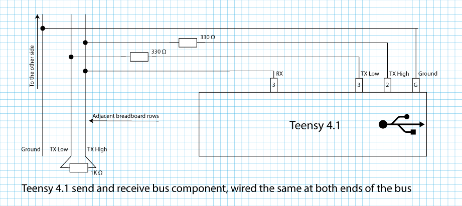
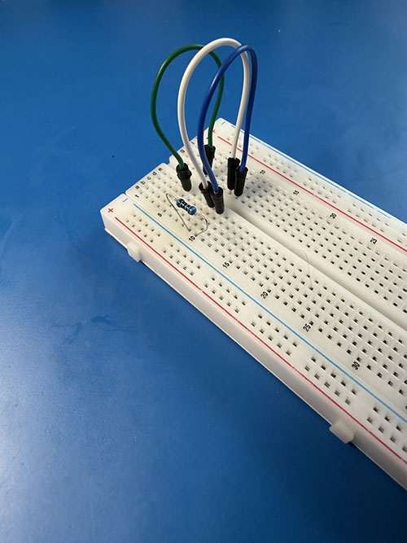
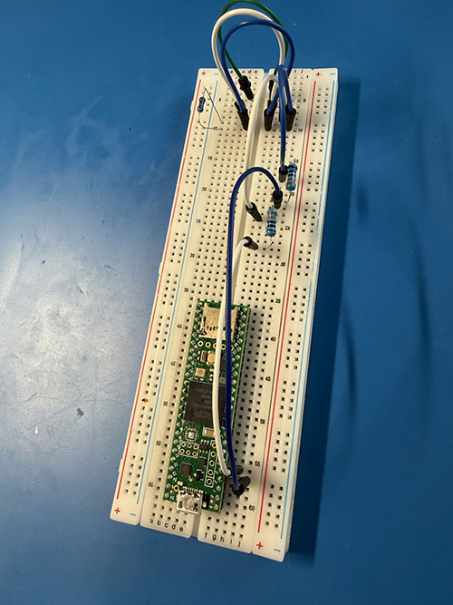
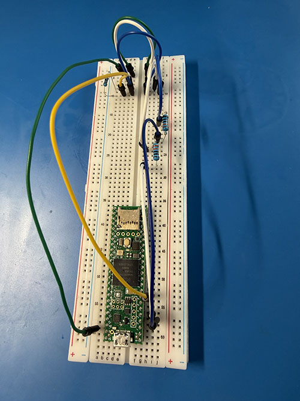
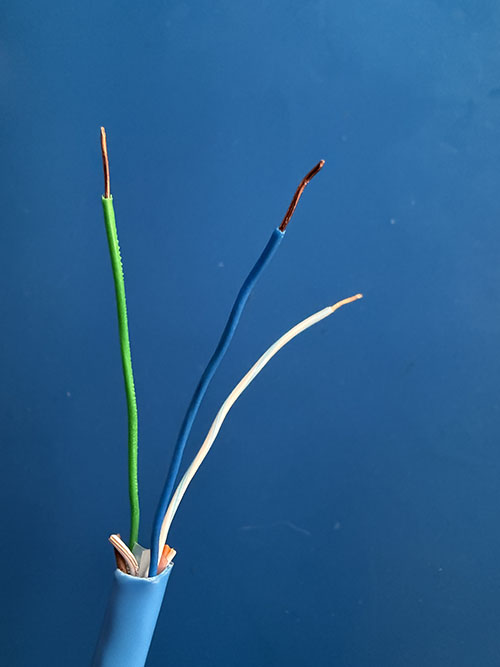

[//]: # (Lab_06A.md)
[//]: # (Copyright © 2026 Joel A Mussman. All rights reserved.)
[//]: #


# Lab 6: Application Layer

\[ [Lab Table of Contents](./README.md#labs) \]

## Section A: Implement an application that embeds a Bus Controller

### Hardware Required

1. The breadboard setup from the completion of Lab 5.
    *Do not touch this without anti-static protection!*

### Lab Steps

This focuses on the interface provided by the MIL1553 library from the FLex1553 project.
In order to manage the signal on the wire, the application uses this interface.

#### Part 1: Build up the application

1. In the Arduino IDE use the menu item **File > New Sketch** to create a new, empty sketch file.

1. Use **File > Save As...* and name the sketch *BC*.
1. Wait for the window to close and reopen with the newly named sketch.
1. "Include" header files in C++ have the definitions of the library functions and object-oriented classes
    used by client applications.
    Start the program code in the IDE by including the header files for the Arduino environment, the Flex1553 library, and the MIL1553 library to interface
    the application to the microcontroller:
    ```cpp
    #include <Arduino.h>
    #include <Flex1553.h>
    #include <MIL1553.h>
    ```

1. The remote terminal address and subaddress, as well as the word count of data
    expected to be sent, would be placed into the "schedule" the bus controller runs.
    For the moment, these values are hardwired into the application as the only command to
    send instead of building a full schedule loop (// begins a comment in the code, and
    the blank line preceding it is only to enhance readability of the application code):
    ```cpp

    #define LEDPIN LED_BUILTIN
    #define RX1553PIN 6
    #define REMOTE_TERMINAL_ADDRESS 7   // Send to RT 5 subaddress 2 (no particular reason why these numbers)
    #define SUBADDRESS 2
    #define WC 5
    ```
1. Recall that the embedded FlexIO controller is passed a stream of bits, and it handles sending each
    bit in a µ-long space.
    Configure an instance of the Flex1553 transmit class to transmit the signal on pings 2 and 3:
    ```cpp

    FlexIO_1553TX flex1553TX(FLEXIO1, FLEX1553_PINPAIR_3);
    ```

1. Add an instance of the Flex1553 receive class to process the response from the remote terminal:
    ```cpp
    FlexIO_1553RX flex1553RX(FLEXIO2, RX1553Pin);
    ```

1. The Flex1553 transmit and receive class instances are low level objects and interface to the embedded FlexIO controller.
    The purpose is to initialize an instance of *MIL_1553_BC* bus controller class:
    ```cpp
    MIL_1553_BC  myBusController(&flex1553TX, &flex1553RX);
    ```

1. A *MIL_1553_packet* instance will encapsulate the information about the command to the RT and the data:
    ```cpp

    MIL_1553_packet myPacket;
    ```

1. The Arduino environment has two functions: *setup()* to initialize the microcontroller, and *loop()* to repeat
    the execution of a section of program in the microcontroller *forever*.
    The first line of the *setup()* function initializes the LED on the microcontroller as an output channel:
    ```cpp
    void setup() {
        pinMode(LEDPIN, OUTPUT);
    ```

1. In the setup the BC object instance needs to be told to start up in order to send data on the wire:
    ```cpp
        myBusController.begin();
    ```

1. The packet encapsulates the information that will be used for the transmission.
    Clear it and initialize the RT address, subaddress, word count, and receive or transmit, and close
    the function body with a *}*:
    ```cpp

        myPacket.clear();
        myPacket.setRta(REMOTE_TERMINAL_ADDRESS);
        myPacket.setSubAddress(SUBADDRESS);
        myPacket.setWordCount(WC);
        myPacket.setTrDir((trDir_t)TRANSMIT);
    }
    ```

1. The loop repeats a block of code forever.
    Use these lines to start the loop and the code block of statements that belong to it:
    ```cpp
    void loop()
    {
    ```

1. Execute a command to turn the board LED on:
    ```cpp
        digitalWrite(LEDPIN, HIGH);
    ```

1. Use the MIL1553 library bus controller *interface* to send the command word on the wire to
    ask the RT to send data (a request on the BC side is a "send data" request):
    ```cpp
        myBusController.request(&myPacket, FLEX1553_BUS_A);
    ```

1. Execute a command to turn off the board LED.
    This will happen very fast, so visually the LED will show a very slight flicker or remain on dimly:
    ```cpp
        digitalWrite(LEDPIN, LOW);
    ```

1. Finish up the block of code for the *loop()* function with a four-µs delay and the end of the loop block:
    ```cpp
        delay(4);
    }
    ```

1. Double-check the work against this complete program:
    ```cpp
    #include <Arduino.h>
    #include <Flex1553.h>
    #include <MIL1553.h>

    #define LEDPIN LED_BUILTIN
    #define RX1553PIN 6
    #define REMOTE_TERMINAL_ADDRESS 7 // Send to RT 7 subaddress 2 (no particular reason why these numbers)
    #define SUBADDRESS 2
    #define WC 5

    FlexIO_1553TX flex1553TX(FLEXIO1, FLEX1553_PINPAIR_3);
    FlexIO_1553RX flex1553RX(FLEXIO2, RX1553PIN);
    MIL_1553_BC  myBusController(&flex1553TX, &flex1553RX);
    MIL_1553_packet myPacket;

    void setup() {
        pinMode(LEDPIN, OUTPUT);
        myBusController.begin();

        myPacket.clear();
        myPacket.setRta(REMOTE_TERMINAL_ADDRESS);
        myPacket.setSubAddress(SUBADDRESS);
        myPacket.setWordCount(WC);
        myPacket.setTrDir((trDir_t)TRANSMIT);
    }

    void loop()
    {
        digitalWrite(LEDPIN, HIGH);
        myBusController.send(&myPacket, FLEX1553_BUS_A);
        digitalWrite(LEDPIN, LOW);
        delay(4);
    }
    ```

#### Part 2: Compile, load, and test the program:

1. The microcontroller and logic analyzer were left connected to the USB and powered up in the previous lab.
    Verify this is still true, if not connect and power up the components.

1. Use the green arrow *Run* button on the IDE toolbar to compile and load the program
    (fix any errors that may occur compiling the code).
1. Run a capture in the Logic 2 program.
1. Why is there only one command word (repeating) on the wire?
1. Decipher the command word: What is the notation?

## Section B: Complete the message cycle between a Bus Controller and a Remote Terminal

## Result

The goal of this section is to use two identical bus components built on the breadboard to communicate
with each other.
One will be the BC, the other an RT.
The wiring is exactly the same for both components, they simply need to be connected together with a
twisted pair cable and a ground wire.
To build a bus with three components A, B, and C, remove the resistor in the middle component B, connect wires from
component A to one end of the bus on B, and to the other end of the bus to component C.



On a breadboard the twisted pair bus is kept on two adjacent rows.
This is a short run, the signals are as close together as possible, and it is inside the three
inches so no twist needed.

Pin 6 is used for receiving the bus signal, it is set to a very high impedance and it will not be the exit point for electrons.
Pins 2 and 3 are as the transmitters, have a low impedance, and could be damaged by the signal on the bus.
The 330 &Omega; resistors increase the impedance on before those pins to protect them so the signal does not blow them out.

This lab has the potential to create a bus where the impedance is so high that the 3.3 volt signal
is not recognizable on the receiving end.
This will be indicated by a failure of the logic analyzer to read the expected data,
or by the signal and voltage on an oscilloscope if one is available.
Shortening the connecting cable should help, although this has been tested with twenty foot cables.

### Hardware Required

1. Two breadboard setups from the completion of Lab 6 Section A.
    In a classroom scenario the second will be another lab team, by yourself you need to build a second copy of the setup.
    If there are an odd number of teams in the classroom, three teams will be connected together with one in the middle.
    *Do not touch this without anti-static protection!*

1. One 1K &Omega; resistor (brown, black, black, brown, brown) for each component breadboard.
1. Two 330 &Omega; resistors (brown, black, black, orange, orange) for each component breadboard.
1. Assorted jumper wires.

### Lab Steps

#### Part 1: Rebuild and extend the simulated MIL-STD-1553 bus

Implement the circuit detailed in the schematic above.
This is very similar to the bus created in the first lab with the breadboard, and
you can use as a starting point if you want or rip it all out and start over.
The colors of the jumper wires are critical, for example if you have gray but not white then use gray.
The socket locations on the breadboard are not specifically required; these have simply been chosen for
ease of connecting the resistors and jumper wires.

1. Make sure the microcontroller and the logic analyzer are not connected to USB, and are not powered.

1. Make sure of proper grounding before following these steps to reconfigure the breadboard.
1. Add a jumper wire (blue) between E10 and F10 over the center isolation groove for the center line (simulated).
1. Add a jumper wire (white) between E9 and F9 for the center ring.
1. Add a jumper wire (green) between E5 and F5.
1. If this component will be at one end of the bus, place a 1K &Omega; resistor (brown, black, black, brown, brown) across A10 and A11 to connect them as the bus terminator.
    The 1K resistor has bands brown, black, black, brown, (and possibly) brown.
    Do not use a resistor to connect J10 and J11.
    If this component will be in the middle of the bus do not use the resistor in A10 and A11.
    <br><br>
1. Place a 330 &Omega; resistor (brown, black, black, orange, orange) connecting J18 and J22.
1. Place a 330 &Omega; resistor connecting H24 and H28.
1. Connect a (white) jumper wire from I56 to G28 (the TX Low line on pin 3 to the 330 &Omega; resistor).
1. Connect a (white) jumper wire from G18 to G9 (pass TX Low to the low bus wire).
1. Connect a (blue) jumper wire from J57 to I22 (the TX High line on pin 2 to the 330 &Omega; resistor).
1. Connect a (blue) jumper wire from I18 to I10 (pass TX High to the high bus wire).
    <br><br>]
1. Run a (yellow) jumper wire from I53 to C10 (this is the RX line from the bus to the microcontroller).
    No resistor is required for this connection because the RX impedance is already so high at the pin there is
    no need to protect it
1. Add a connection (green) from the A59 in the second ground pin row on the microcontroller to A5 on the simulated bus.
    <br><br>
1. Repeat steps 3-14 on the other breadboard that will be connected.
1. Bridge the two lines and the ground line between the two boards using the Cat-6 Ethernet cable.
    If the cable ends have not been prepared (stripped) make the cable if the ends:
    1. This has been tested with cables up to six meters.
    1. Strip two inches of insulation from the cable at both ends.
    1. Cut away any center plastic reinforcement, string, and the orange-white/orange and brown/white-brown wires.
    1. Untwist the blue/white-blue and green/white-green wires, and cut away the white-green wire.
    1. Strip the green, blue, and white-blue wires down to the copper, 1/4 inch back.
        <br><br>
1. Connect the wire ends to both components on J10 (blue to TX High), J9 (white/blue to TX Low), and J5 (green to Ground).
    If there are three breadboards the one in the middle has no resistors, so connect one cable to J10, J11, and J5 and
    the cable from the other "device"" to A10, A11, and A5.

#### Part 2: Connect Logic Analyzers

The logic analyzers may be connected to every board if each
team wants to run a capture on their own board.

1. Connect channel 00 of the logic analyzer (black) to A57 (TX High).

1. Connect channel 01 (black) to A56 (TX Low).
1. Connect channel 02 (red) to B10 (TX High on the bus, but the RX will work with that signal).
1. Plug in the USB cables and power up all the microcontrollers and connected Logic Analyzers.

#### Part 3: If there are more than three breadboards (3+ lab teams) clear the additional boards:

One microcontroller will be the BC and another the RT.
Any additional microcontrollers on the bus running as the BC or the RT with the same address will interfere.
When a microcontroller is powered back on it will reload and run the program last installed from non-volatile memory,
so these microcontrollers must be cleared.
*Complete this part on a breadboard that will not be the BC or RT!*

1.  On the computer connected to an additional microcontroller, in the Arduino IDE use the menu option
    **File > New Sketch** to create a new sketch.
    This will open a new window with the new sketch.

1. In the new window verify the new sketch shows the following code.
    If it does not, replace the window contents with this code:
    ```cpp
    void setup() {
    // put your setup code here, to run once:

    }

    void loop() {
    // put your main code here, to run repeatedly:

    }
    ```
1. Use the green arrow "Run" button to compile and load the program to keep the microcontroller from
    interfering with the simulated bus.
1. Repeat this procedure for any other additional microcontrollers besides the BC and RT.

#### Part 4: Load the BC and RT programs and initiate the message

1. Load and run the BC program from Lab 6A on one of the microcontrollers.

1. On the other microcontroller create a new sketch with **File >> New Sketch**.
1. Load and run this implementation of an RT.
    The code is the RT_send_packet.cpp example from the FLex1553 project, without the comments
    (you can read them in the code in the *examples* folder):
    ```cpp
    #include <Arduino.h>
    #include <Flex1553.h>
    #include <MIL1553.h>

    #define LEDPIN LED_BUILTIN
    #define RX1553PIN 6
    #define RTA       7 
    #define MB1_SA    1 
    #define MB1_WC    1 
    #define MB2_SA    2 
    #define MB2_WC    5 

    void printPacket(MIL_1553_packet *packet);

    unsigned long loopCount = 0;
    bool ledState  = false;

    FlexIO_1553TX flex1553TX(FLEXIO1, FLEX1553_PINPAIR_3);
    FlexIO_1553RX flex1553RX(FLEXIO2, RX1553PIN);
    MIL_1553_RT  myRemoteTemrinal(&flex1553TX, &flex1553RX, FLEX1553_BUS_A);
    MIL_1553_packet mailBox1;
    MIL_1553_packet mailBox2;

    void setup() {
        Serial.begin(115200);
        while (!Serial)
            ;

        pinMode(ledPin, OUTPUT);

        if(!myRemoteTemrinal.begin(RTA))
            Serial.println( "myRemoteTemrinal.begin() failed" );

        Serial.println();
        Serial.println("1553 RT Example");

        mailBox1.setData(0, 0);
        mailBox1.newMail = true; 
        ;

        if(!myRemoteTemrinal.openMailbox(MB1_SA, MB1_WC, MIL_1553_RT_OUTGOING, &mailBox1))
            Serial.println("Open mailbox1 failed");

        uint16_t data[] = {0x0012, 0x0034, 0x0056, 0x0078, 0x0910};
        mailBox2.setData(data, MB2_WC);
        if(!myRemoteTemrinal.openMailbox(MB2_SA, MB2_WC, MIL_1553_RT_OUTGOING, &mailBox2))
            Serial.println("Open mailbox2 failed");
    }

    void loop()
    {
        MIL_1553_packet* packet = myRemoteTemrinal.mailSent();
        if (packet != NULL) {
            Serial.print("Data was read from SA ");
            Serial.println(packet->getSubAddress());
            packet->newMail = true;
        }

        if(myRemoteTemrinal.errorAvailable())
            myRemoteTemrinal.printErrReport();

        if (Serial.available() > 0) {
            char c = Serial.read();
            if(c == 'n') {
                uint16_t newData = Serial.parseInt();
                Serial.print("new data = ");
                Serial.print(newData, DEC);
                Serial.print(", 0x");
                Serial.println(newData, HEX);
                mailBox1.setData(0, newData);
            }

            if(c == 'd')
                myRemoteTemrinal.dumpInternalState();

            if(c == 'p')
                myRemoteTemrinal.dumpMailboxAssigments();
        }

        if( (loopCount % 0x0400000L) == 0 ) { 
            ledState = !ledState;
            digitalWrite(ledPin, ledState);
        }

        loopCount++;
    }

    void printPacket(MIL_1553_packet *packet)
    {
        int wc = packet->getWordCount();

        Serial.print(" RTA:");
        Serial.print(packet->getRta());
        Serial.print(" SA:");
        Serial.print(packet->getSubAddress());

        // print status word
        Serial.print(", STATUS:0x");
        Serial.print(packet->getStatusWord(), HEX);

        // Dump out the packet data
        Serial.print(", Payload[");
        Serial.print(wc);
        Serial.print("]:");
        for (int i=0; i<wc; i++)
        {
            Serial.print(packet->getData(i), HEX);
            Serial.print(" ,");
        }
        Serial.println();
    }
    ```

1. Use the green arrow "Run" button in the Arduino IDE on the *second* microcontroller and computer to compile and load
    the RT side of the scenario.
1. In the Arduino IDE locate the magnifying glass icon in the upper right corner and click on it to open a new tab
    at the window bottom with the serial port console.
    This is a feature not examined before, and the RT program will write messages about what it is doing to the console.
1. There may be many messages appearing the serial port console, some good, perhaps some bad.
    If there are any bad ones they are usually about the bus wires not being connected properly.
    Messages about problems with the RT address, subaddress, and word count should not appear because these programs installed in the lab all line up.
1. Capture the signal in the Logic 2 analyzer program on any or all of the computers:
    * The BC command word to have the RT send the data should appear on channel 0.
    * The inverted command word should appear on channel 1.
    * The command word and the response should appear on channel 2.
1. Each team (or individual if there are no teams):
    1. Does the response show on channel 0?
    1. Decode the command word to verify it is asking for the data.
    1. Decode the status word in the response.
    1. Find and decode each of the data words.

<br><br>&nbsp; **Congratulations, you have completed this lab!**

<br><br>
# Answer Key

## Section A

### Part 2

4. The RT is not connected and the command word is requesting a transmission.
1. Bits: 0011110001000101, parity 1, 0x3C45: RT7 T SA2 WC5

## Section B

### Part 4

8. Each team (or individual if there are no teams):
    1. It depends: the 330 &Omega; resistors protect the transmit pins and block most of the signal from going back to those pins. 
    1. Bits: 0011110001000101, parity 1, 0x3C45: RT7 T SA2 WC5
    1. Bits: 0011100000000000, parity 0, all status normal.
    1. Data Words: 0x0012 (18), 0x0034 (52), 0x0056 (86), 0x0078 (120), and 0x0910 (2320)


##
Copyright &copy; 2026. Licensed under the terms specified in the [LICENSE.md](./LICENSE.md) file at the root of this repository.