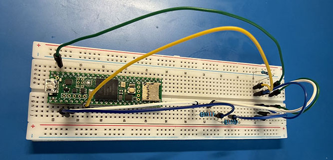

[//]: # (readme.md)
[//]: # (Copyright © 2026 Joel A Mussman. All rights reserved.)
[//]: #

# Explore1553

## Overview

Fortunately practicing or experimenting with the electronics and protocols of MIL-STD-1553 can be accomplished
in a sandbox lab using off-the-shelf components.
Practicing with real MIL-STD-1553 hardware can be prohibitively expensive, and adding real components to a real
network unnecessarily increases the level of difficulty.

*Arduino* microcontrollers are sometimes suggested as a choice for simulating a MIL-STD-1533 component, but there are some problems:
1. They only run at 16Mhz
1. The clock resolution provided by the *delay()* function only has microsecond (µ) resolution
1. Trying to calculate the time used in loops, accessing data, etc. is difficult, must be
    subtracted from the 0.5µs timing for 1/2 of a bit signal, and the only way to do that
    is to execute an instruction with known timing (NOP) and repeat it X times

The *Teensy 4.0/4.1* development board series was chosen for this lab because:

1. It runs at 600 MHz
2. The *delaynanosecond()* function allows the 0.5µs resolution
3. Even better, the NXP i.MX RT1062 microcontroller chip has an integrated FlexIO controller
    that may be fed a stream of bits and keeps the signal low or high for exactly 0.5µs.

Shout-out to Paul Stoffregen at [PJRC](https://www.pjrc.com/) for the Teensy board and the integration into Arduino IDE :)

The sandbox defined by this project is derived from the [Flex1553](https://github.com/bsundahl1/Flex1553) project at GitHub by Bill Sundahl (*bsundahl1*).
Bill's project is focused on using transformers and amplifiers to integrate the Teensy as a bus controller or remote terminal into a real MIL-STD-1553 network.
The reality is that the microcontroller generates and receives DC signals, and only positive signals.
The MIL-STD-1553 bus carries AC current at 18-27 volts, so there has to be translation hardware for outbound and inbound signals.

The goal for this sandbox is the timing of the signals and interpreting them, so it is not necessary to go too deep into the Flex1553 project and
provide the translation electronics.
Working with the DC signals will be sufficient.

## Hardware & Software Requirements

This sandbox may be used with multiple teams in a classroom environment (the classroom kit supports five teams), or by individuals for their own experimentation.

### Hardware
1. Anti-static mat and wrist-strap, this one from Amazon is used in class and has both a wrist-strap and a grounding wire:
    [Anti-Static Mat](https://www.amazon.com/Anti-Static-Mat-ESD-Soldering-Electronics/dp/B0CB81S8VV).
    Another advantage of this mat is the size; you can put it on a desk in front of a monitor work with the electronics and the
    computer at the same time.
    Tip: in class the grounding wire was connected to a grounded electrical plug, so it is fast to plug it into the same electrical
    circuit as the computer is on to ground everything properly, and quickly unplug it as well.
    These plugs came from Amazon, but Lowe's, Home Depot, Walmart, etc. will have them: [Search on Amazon](https://www.amazon.com/dp/B0CJ55LTZN).
1. One six-inch breadboard and jumper wires for mocking up circuits [Search on Amazon](https://www.amazon.com/dp/B08Y59P6D1).
1. A second breadboard for individuals; multiple teams in a class will link their boards.
1. A Teensy 4.1 microcontroller board with male headers to plug into the breadboard [Search on Amazon](https://www.amazon.com/s?k=Teensy+4.1+with+headers).
1. A second Teensy 4.1 microcontroller for individuals (multiple teams in a class share microcontrollers).
1. A Micro-USB data cable to connect the Teensy 4.1 to the computer (it does not come with one).
1. A Saleae-type USB logic analyzer [Search on Amazon](https://www.amazon.com/s?k=HiLetgo+USB+Logic+Analyzer).
    Most of these come with their own USB cable, but make sure.
    Technically any logic analyzer should work, but you are on your own with others.
1. A small zip-tie for individuals (used in [Lab 3](./Lab_03.md) for strain-relief on the logic analyzer cable).
1. Two 81 &Omega; (or 68 &Omega; in a pinch), two 380 &Omega;, and two 1k &Omega; resistors [Search on Amazon](https://www.amazon.com/Avelis-Resistors-Assortment-Precision-Electronic/dp/B0FNRD8B3X).
1. Needle-nose pliers for placing components on the breadboard [Search on Amazon](https://www.amazon.com/Dykes-Needle-Pliers-Extra-6-Inch/dp/B0733NWRCS),
    or if a store is close by they are cheaper here: [Search at Harbor Freight](https://www.harborfreight.com/5-34-in-needle-nose-pliers-63815.html). 
1. 15-20 feet of Cat-6 Ethernet cable to connect team projects together (individuals can use jumper wires).
1. A multimeter, preferably with fine-tip (for breadboard) or alligator-clip tipped probes [Search on Amazon](https://www.amazon.com/KAIWEETS-Multimeter-Digital-Voltmeter-Continuity/dp/B08CX9W7G3).
1. An entry-level 100MHz, dual channel oscilloscope (used in class but not necessary for individuals) [Search on Amazon](https://www.amazon.com/FNIRSI-1014D-Dual-Channel-Oscilloscope-Generator-Bandwidth/dp/B097T5NRTZ).

### Software

This software is all free, and everything supports Microsoft Windows, Apple MacOS, and Linux.

1. Arduino IDE 2.X+ for compiling programs and uploading to Arduino/Teensy microcontrollers, download from [Arduino Software](https://www.arduino.cc/en/software/)
1. Saleae Logic 2 for capturing and analyzing signals from the microcontroller, download from [Saleae](https://www.saleae.com/downloads)*
1. Microsoft Visual Studio Code for creating and editing programs outside of the IDE, download from [Microsoft](https://code.visualstudio.com/download)

 * If you are questioning why the very popular [Sigrok PulseView](https://sigrok.org/wiki/Downloads) (which supports many logic analyzers)
was not chosen:
1. On MacOS this worked fine.
1. On Microsoft Windows you have to use the PulseView ZaDig tool to add the USB driver, and that requires admin privileges
1. The recorded signal was jittery compared to Logic 2, yet it was the same analyzer and the signal was fine on a scope
1. There is no particular reason you could not successfully use it for the labs if you choose to

## Labs

* [Lab 1: Introduction](./Lab_01.md)
* [Lab 2: Bus Architecture](./Lab_02.md)
* [Lab 3: Media Layer](./Lab_03.md)
* [Lab 4: Physical Layer](./Lab_04.md)
* [Lab 5: Data Link Layer](./Lab_05.md)
* [Lab 6: Application Layer](./Lab_06.md)

## Free Resources

* [United States of America Department of Defense MIL-STD-1553C](./.assets/resources/mil-std-1553c.pdf)
* [United States of America Department of Defense MIL-STD-1553B](./.assets/resources/mil-std-1553b.pdf)
* [United States of America Department of Defense MIL-HDBK-1553A](./.assets/resources/mil-hdbk-1553a.pdf)
* [United States of America Department of Defense DOD-STD-100D (superseded by)](./.assets/resources/dod-std-00100d.pdf)
* [United States of America Department of Defense MIL-W-5088L (superseded by SAE AS50881)](./.assets/resources/mil-w-5088l.pdf)
* [AIM GmbH MIL-STD-1553 Tutorial](https://www.aim-online.com/wp-content/uploads/2019/01/aim-ovw1553-u.pdf)
* [Alta Data Technologies MIL-STD-1553 Tutorial and Reference](https://www.altadt.com/download/mil-std-1553-tutorial-and-reference/?tmstv=1773603864)
* [Condor Engineering MIL-STD-1553 Tutorial (Absorbed and superceded by ALta Data Technologies)](http://www.horntech.cn/techDocuments/MIL-STD-1553Tutorial.pdf)
* [United Electronic Industries MIL-STD-1553 Tutorial (online with videos)](https://www.ueidaq.com/mil-std-1553-tutorial-reference-guide)
* [MilesTek Basics of MIL-STD-1553 Interconnect for Military Applications & Beyond](https://spiritelectronics.com/wp-content/uploads/2025/05/MT-1553-Interconnects-for-Military-Application-and-Beyond.pdf)
* [Holt Integrated Circuits MIL-STD-1553 Bus Connections for Test Configurations](https://www.holtic.com/documents/482-an-551_v-rev-newpdf.do)
* [milstd1553.com: additional resources and reference links](https://milstd1553.com)

##
Copyright &copy; 2026. Licensed under the terms specified in the [LICENSE.md](./LICENSE.md) file at the root of this repository.